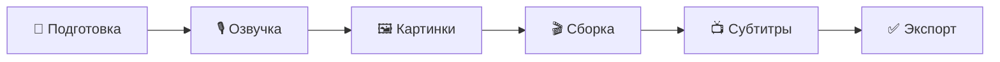
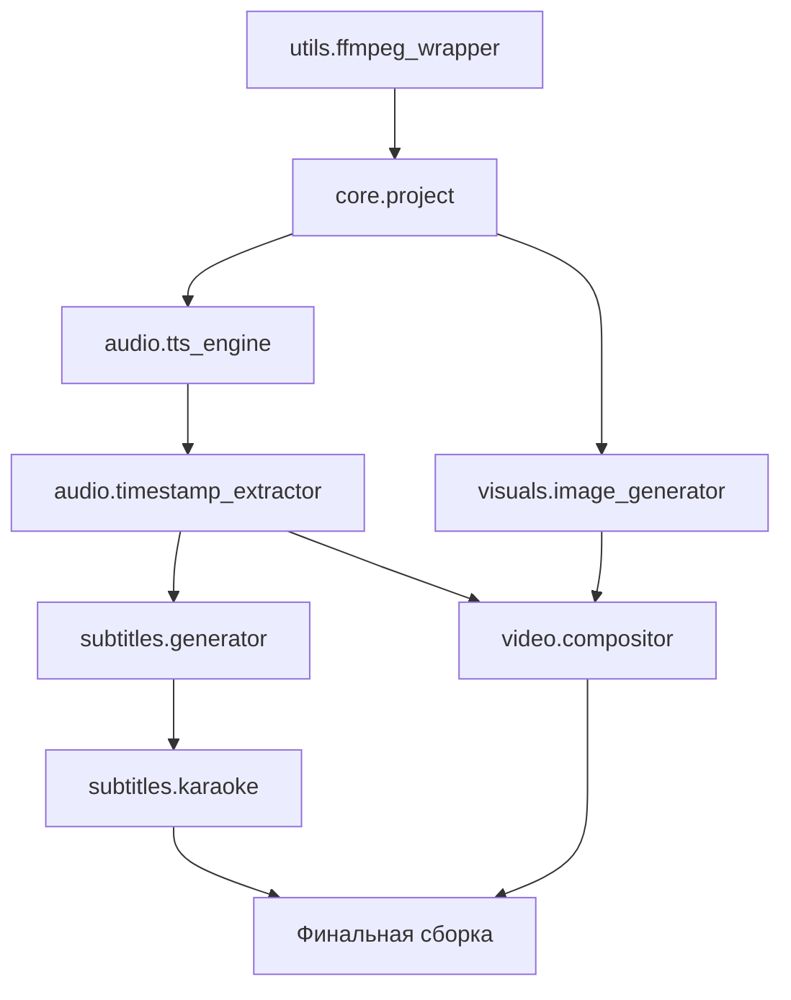

# NovaClips MVP Plan

> **Цель MVP:** Создать минимальный работающий pipeline для производства одного faceless YouTube видео — от готового сценария до финального видео с субтитрами.

---

## 🎯 Scope MVP

### Что ВХОДИТ в MVP
- Ввод готового сценария (текстовый файл)
- Генерация озвучки (TTS)
- Получение word-level timestamps
- Генерация картинок по промптам
- Сборка видео из картинок + аудио
- Генерация субтитров с karaoke-эффектом
- Экспорт финального видео

### Что НЕ входит в MVP
- Генерация идей/сценариев (ручной ввод)
- Публикация на YouTube (ручная)
- Аналитика
- Работа с музыкой
- A/B тестирование
- Мультиязычность

---

## 📋 Этапы производства MVP



---

## Этап 1: Подготовка (👤 Человек + 🤖 Модуль)

### 1.1 Создание сценария (👤 Человек)

**Артефакты на входе:** Идея ролика  
**Артефакты на выходе:** `{project}/script/script-final.md`

#### Инструкция для человека:

1. Создать папку проекта: `data/projects/{video-id}/`
2. Подготовить сценарий, следуя **[Manual Script Workflow](../script-generation-workflow.md)**.
3. Сохранить финальный результат в `script/script-final.md` со структурой:

```markdown
---
title: Название видео
duration_target: 5-10 min
voice: alloy  # или другой голос
---

## Сцена 1: Hook
[VISUAL: type=example, prompt="Яркий пример проблемы"]

Захватывающий первый крючок, который заставит досмотреть...

## Сцена 2: Карта
[VISUAL: type=diagram, prompt="Инфографика с 3 пунктами"]

Сегодня вы узнаете три секрета...

## Сцена 3: Основной контент
[VISUAL: type=metaphor, prompt="Визуальная метафора роста"]

Первый секрет — это...

## CTA
[VISUAL: type=quote, prompt="Призыв к действию на красивом фоне"]

Подписывайтесь и ставьте лайк...
```

3. Проверить:
   - [ ] Есть hook в первые 10 секунд
   - [ ] Есть pattern interrupt каждые 45-90 секунд
   - [ ] Есть CTA в конце
   - [ ] Каждая сцена имеет `[VISUAL: ...]` разметку

---

### 1.2 Парсинг сценария (🤖 Модуль: `core.project`)

**Артефакты на входе:** `script/script-final.md`  
**Артефакты на выходе:**
- `planning/scenes.yaml` — список сцен с текстом и prompt'ами
- `planning/config.yaml` — настройки проекта

**Модуль:** [core.project](./modules/core-project.md)

---

## Этап 2: Озвучка (🤖 Автоматизация)

### 2.1 Нормализация текста

**Модуль:** встроен в `audio.tts_engine`

- Числа → слова ("2024" → "две тысячи двадцать четыре")
- Аббревиатуры → расшифровка
- Специальные символы → текст

### 2.2 Генерация TTS

**Артефакты на входе:** `planning/scenes.yaml`  
**Артефакты на выходе:**
- `audio/voice.mp3` — полная озвучка
- `audio/voice.json` — word-level timestamps

**Модуль:** [audio.tts_engine](./modules/audio-tts-engine.md)

### 2.3 Валидация (👤 Человек)

#### Инструкция для человека:

1. Прослушать `audio/voice.mp3`
2. Проверить:
   - [ ] Темп речи комфортный
   - [ ] Нет ошибок произношения
   - [ ] Паузы в правильных местах
3. При необходимости — отредактировать сценарий и перегенерировать

---

## Этап 3: Картинки (🤖 Автоматизация)

### 3.1 Генерация картинок

**Артефакты на входе:** `planning/scenes.yaml` (промпты)  
**Артефакты на выходе:** `frames/scene-{N}.png`

**Модуль:** [visuals.image_generator](./modules/visuals-image-generator.md)

### 3.2 Проверка качества (👤 Человек)

#### Инструкция для человека:

1. Просмотреть все картинки в `frames/`
2. Для каждой проверить:
   - [ ] Соответствует теме сцены
   - [ ] Нет артефактов/искажений
   - [ ] Качество достаточное
3. Для плохих картинок:
   - Отредактировать промпт в `planning/scenes.yaml`
   - Запустить регенерацию конкретной сцены

---

## Этап 4: Сборка видео (🤖 Автоматизация)

### 4.1 Расчёт тайминга

**Артефакты на входе:**
- `planning/scenes.yaml`
- `audio/voice.json`

**Артефакты на выходе:** `planning/timing.yaml`

**Модуль:** [audio.timestamp_extractor](./modules/audio-timestamp-extractor.md)

### 4.2 Композиция видео

**Артефакты на входе:**
- `frames/scene-*.png`
- `audio/voice.mp3`
- `planning/timing.yaml`

**Артефакты на выходе:** `video/draft.mp4`

**Модуль:** [video.compositor](./modules/video-compositor.md)

---

## Этап 5: Субтитры (🤖 Автоматизация)

### 5.1 Генерация субтитров

**Артефакты на входе:** `audio/voice.json`  
**Артефакты на выходе:** `subtitles/subs.ass`

**Модуль:** [subtitles.generator](./modules/subtitles-generator.md)

### 5.2 Karaoke эффект

**Артефакты на входе:** `subtitles/subs.ass`  
**Артефакты на выходе:** `subtitles/subs-karaoke.ass`

**Модуль:** [subtitles.karaoke](./modules/subtitles-karaoke.md)

### 5.3 Вшивание субтитров

**Артефакты на входе:**
- `video/draft.mp4`
- `subtitles/subs-karaoke.ass`

**Артефакты на выходе:** `video/final.mp4`

**Модуль:** [utils.ffmpeg_wrapper](./modules/utils-ffmpeg-wrapper.md)

---

## Этап 6: Финализация (👤 Человек)

### 6.1 Финальный просмотр

#### Инструкция для человека:

1. Посмотреть `video/final.mp4` полностью
2. Проверить:
   - [ ] Субтитры синхронизированы с голосом
   - [ ] Картинки переключаются в нужные моменты
   - [ ] Нет технических проблем (глитчи, тишина)
   - [ ] Видео смотрится целостно

### 6.2 Экспорт для YouTube

**Артефакты на выходе:** `export/youtube.mp4`

---

## 🤖 Список модулей для MVP

| # | Модуль | Описание | Приоритет |
|---|--------|----------|-----------|
| 1 | [core.project](./modules/core-project.md) | Парсинг сценария, структура проекта | 🔴 Critical |
| 2 | [audio.tts_engine](./modules/audio-tts-engine.md) | Генерация озвучки TTS | 🔴 Critical |
| 3 | [audio.timestamp_extractor](./modules/audio-timestamp-extractor.md) | Word-level timestamps | 🔴 Critical |
| 4 | [visuals.image_generator](./modules/visuals-image-generator.md) | Генерация картинок | 🔴 Critical |
| 5 | [video.compositor](./modules/video-compositor.md) | Сборка видео | 🔴 Critical |
| 6 | [subtitles.generator](./modules/subtitles-generator.md) | Генерация субтитров | 🔴 Critical |
| 7 | [subtitles.karaoke](./modules/subtitles-karaoke.md) | Karaoke эффект | 🟡 Important |
| 8 | [utils.ffmpeg_wrapper](./modules/utils-ffmpeg-wrapper.md) | Обёртка FFmpeg | 🔴 Critical |

---

## 📁 Структура файлов проекта

```
data/projects/{video-id}/
├── script/
│   └── script-final.md          # Сценарий (входные данные)
├── planning/
│   ├── scenes.yaml              # Распарсенные сцены
│   ├── config.yaml              # Конфигурация проекта
│   └── timing.yaml              # Тайминг сцен
├── audio/
│   ├── voice.mp3                # Озвучка
│   └── voice.json               # Timestamps
├── frames/
│   ├── scene-001.png
│   ├── scene-002.png
│   └── ...
├── subtitles/
│   ├── subs.ass                 # Субтитры
│   └── subs-karaoke.ass         # С karaoke
├── video/
│   ├── draft.mp4                # Без субтитров
│   └── final.mp4                # Финальное
└── export/
    └── youtube.mp4              # Для загрузки
```

---

## 🏃 Порядок разработки модулей



### Рекомендуемая последовательность:

1. **`utils.ffmpeg_wrapper`** — базовый функционал работы с видео/аудио
2. **`core.project`** — парсинг сценария и структура проекта
3. **`audio.tts_engine`** + **`audio.timestamp_extractor`** — аудио pipeline
4. **`visuals.image_generator`** — генерация картинок
5. **`video.compositor`** — сборка видео
6. **`subtitles.generator`** + **`subtitles.karaoke`** — субтитры
7. **Интеграция** — CLI для запуска полного pipeline

---

## ✅ Критерии готовности MVP

- [ ] Можно создать видео 5-10 минут из текстового сценария
- [ ] Аудио синхронизировано с переключением картинок
- [ ] Субтитры с karaoke-эффектом работают корректно
- [ ] Весь процесс занимает < 30 минут (без учёта генерации картинок)
- [ ] Документация позволяет человеку выполнить ручные шаги
