# Detailed Production Plan for Faceless YouTube Videos

> **Format:** Faceless channel with changing images, light animation, voiceover, and subtitles.  
> **Duration:** 5–15 minutes

---

## Table of Contents

1. [Production Phases](#1-production-phases)
2. [Detailed Phase Description](#2-detailed-phase-description)
3. [All Use Cases](#3-all-use-cases)
4. [Automation Matrix](#4-automation-matrix)
5. [Control Points (Gates)](#5-control-points-gates)
6. [Artifacts and File Structure](#6-artifacts-and-file-structure)

---

## 1. Production Phases

```mermaid
flowchart LR
    A[1. Idea] --> B[2. Research]
    B --> C[3. Script]
    C --> CA[3.5 Visual Style]
    CA --> D[4. Shot List]
    D --> E[5. Voiceover]
    E --> F[6. Timing]
    F --> G[7. Visuals]
    G --> H[8. Video Assembly]
    H --> I[9. Subtitles]
    I --> J[10. QA & Export]
    J --> K[11. Publication]
    K --> L[12. Analytics]
```



---

## 2. Detailed Phase Description

### Phase 1: Idea

**Goal:** Define the video topic and the key promise to the viewer.

| Step | Description | Automated? |
|------|-------------|------------|
| 1.1 | Niche/Topic selection | ❌ Manual (creative decision) |
| 1.2 | "1 result promise" formulation | ⚠️ Partial (LLM can suggest options) |
| 1.3 | Demand check (YouTube trends, competitors) | ⚠️ Partial (parsing, but interpretation is manual) |
| 1.4 | Potential assessment (CTR, retention forecast) | ⚠️ Partial (analytics based on historical data) |

**Use Cases:**
- UC-1.1: Choosing a topic from a pre-prepared list of ideas
- UC-1.2: Generating ideas based on trends
- UC-1.3: Competitor analysis for topic validation
- UC-1.4: Relaunching a successful video in a new format

**Artifacts:**
- `idea-brief.yaml` — brief idea description

---

### Phase 2: Research

**Goal:** Collect facts, examples, and sources for the content.

| Step | Description | Automated? |
|------|-------------|------------|
| 2.1 | Searching for scientific sources/articles | ⚠️ Partial (search + summary) |
| 2.2 | Compiling a list of key points | ⚠️ Partial (LLM extraction) |
| 2.3 | Finding examples/cases | ⚠️ Partial (search, selection is manual) |
| 2.4 | Risk review (medical/financial/sensitive topics) | ❌ Manual (legal responsibility) |
| 2.5 | Fact-checking | ⚠️ Partial (LLM can help, but verification is needed) |

**Use Cases:**
- UC-2.1: Research from scratch on a new topic
- UC-2.2: Expanding existing research with additional sources
- UC-2.3: Adapting English-language research for a local audience
- UC-2.4: Compiling research from several past videos

**Artifacts:**
- `research.md` — list of sources and points
- `risk-review.md` — notes on sensitive topics

---

### Phase 3: Script

**Goal:** Write the full text for the voiceover.

| Step | Description | Automated? |
|------|-------------|------------|
| 3.1 | Script structure (hook → roadmap → points → summary → CTA) | ✅ Automated (template + LLM) |
| 3.2 | Writing the hook (0–10 sec) | ⚠️ Partial (LLM + manual editing) |
| 3.3 | Writing the main content | ⚠️ Partial (LLM draft + editing) |
| 3.4 | Adding "pattern interrupts" every 45–90 sec | ⚠️ Partial (LLM can place markers) |
| 3.5 | Final editing and proofreading | ❌ Manual |
| 3.6 | Setting scene markers | ✅ Automated |

**Use Cases:**
- UC-3.1: Generating a script from scratch based on research
- UC-3.2: Editing/improving an existing script
- UC-3.3: Adapting the script for a different duration (shorter/longer)
- UC-3.4: Translation and localization of the script
- UC-3.5: A/B test — creating an alternative hook
- UC-3.6: Rewriting the script in a different style/tone

**Artifacts:**
- `script-v{N}.md` — script version with scene markers

---

### Phase 3.5: Visual Style and Character Development

**Goal:** Establish the visual language of the video and define the appearance of the characters.

| Step | Description | Automated? |
|------|-------------|------------|
| 3.5.1 | Visual concept description (atmosphere, colors) | ⚠️ Partial (LLM draft) |
| 3.5.2 | Generating 5–10 concept arts (characters, key scenes) | ✅ Automated (generation by prompts) |
| 3.5.3 | Selecting reference style for the shot list | ❌ Manual (creative choice) |
| 3.5.4 | Creating a prompt mini-guide (Style Bible) | ⚠️ Partial (LLM extraction from successful generations) |

**Use Cases:**
- UC-3.5.1: Creating a unique character for a series of videos
- UC-3.5.2: Defining the color palette (noir, neon, minimalist)
- UC-3.5.3: Generating a "moodboard" for approval with the creator/client
- UC-3.5.4: Fixing Seed numbers for consistency (if applicable)

**Artifacts:**
- `viz-concept/concept-images/` — folder with 5–10 best concepts
- `viz-concept/style-guide.md` — style description and key prompts

---

### Phase 4: Shot List (Scenes)

**Goal:** Plan the visual sequence — what to show at each moment.

| Step | Description | Automated? |
|------|-------------|------------|
| 4.1 | Breaking the script into semantic blocks | ✅ Automated (by markers/paragraphs) |
| 4.2 | Defining visual type for a block | ⚠️ Partial (LLM suggests, selection is manual) |
| 4.3 | Writing prompts for image generation | ⚠️ Partial (LLM generates, but editing may occur) |
| 4.4 | Defining motion effects (zoom, pan) | ⚠️ Partial (by rules/templates) |
| 4.5 | Defining scene transitions | ✅ Automated (by template) |

**Visual Block Types:**
1. **Character/Speaker** — drawn character (optional)
2. **Scheme/Diagram** — for explaining concepts
3. **Checklist/List** — for practical steps
4. **Timeline** — for sequences
5. **Real-life example** — situation illustration
6. **Metaphor** — abstract visualization
7. **Quote** — text on background
8. **Infographic** — numbers/statistics

**Use Cases:**
- UC-4.1: Generating a shot list for a new script
- UC-4.2: Updating the shot list after script edits
- UC-4.3: Changing visual type for a specific scene
- UC-4.4: Bulk regenerating prompts for a new style

**Artifacts:**
- `shotlist.yaml` — scenes with visual types and prompts

---

### Phase 5: Voiceover (TTS)

**Goal:** Obtain audio narration of the script.

| Step | Description | Automated? |
|------|-------------|------------|
| 5.1 | Text normalization (numbers → words, abbreviations) | ✅ Automated |
| 5.2 | Splitting into chunks (by sentences/paragraphs) | ✅ Automated |
| 5.3 | Generating TTS for each chunk | ✅ Automated |
| 5.4 | Obtaining word-level timestamps | ✅ Automated (if API supported) |
| 5.5 | Stitching audio with pauses between sections | ✅ Automated |
| 5.6 | Loudness normalization | ✅ Automated |
| 5.7 | Listening and editing (if needed) | ❌ Manual |

**Use Cases:**
- UC-5.1: Generating full voiceover from scratch
- UC-5.2: Regenerating a separate fragment
- UC-5.3: Changing the voice for the entire video
- UC-5.4: Adding/changing pauses
- UC-5.5: Regeneration after script edits
- UC-5.6: Multilingual versions (translation + voiceover)

**Artifacts:**
- `audio/voice.mp3` — final voiceover
- `audio/voice.json` — word-level timestamps

---

### Phase 6: Timing and Synchronization

**Goal:** Link visuals with audio in time.

| Step | Description | Automated? |
|------|-------------|------------|
| 6.1 | Mapping scenes to audio time segments | ✅ Automated (by markers in script) |
| 6.2 | Calculating duration of each image | ✅ Automated |
| 6.3 | Adding buffers/paddings | ✅ Automated |
| 6.4 | Validation (no too short/long scenes) | ✅ Automated |
| 6.5 | Manual timing correction | ❌ Manual (if necessary) |

**Use Cases:**
- UC-6.1: Auto-calculating timing based on shot list and audio
- UC-6.2: Manual correction of a specific scene
- UC-6.3: Recalculation after audio changes

**Artifacts:**
- `timing.yaml` — scene timecodes

---

### Phase 7: Visuals Generation

**Goal:** Create images for each scene.

| Step | Description | Automated? |
|------|-------------|------------|
| 7.1 | Sending prompts to image API | ✅ Automated |
| 7.2 | Saving and naming files | ✅ Automated |
| 7.3 | Quality check (artifacts, wrong style) | ⚠️ Partial (detection can be automated) |
| 7.4 | Regenerating failed images | ⚠️ Partial (automatic retry + manual control) |
| 7.5 | Post-processing (resize, color correction) | ✅ Automated |
| 7.6 | Visual style consistency | ⚠️ Partial (style reference, but control needed) |

**Use Cases:**
- UC-7.1: Batch generation of all video images
- UC-7.2: Regenerating a separate image
- UC-7.3: Changing style of all images
- UC-7.4: Using stock images instead of generation
- UC-7.5: Mix of generation + stock
- UC-7.6: Upscale/resolution improvement

**Artifacts:**
- `frames/scene-{N}.png` — scene images

---

### Phase 8: Video Assembly

**Goal:** Assemble the final video from images + audio.

| Step | Description | Automated? |
|------|-------------|------------|
| 8.1 | Generating video from images with timing | ✅ Automated (FFmpeg) |
| 8.2 | Adding transitions (fade, dissolve, etc.) | ✅ Automated |
| 8.3 | Adding motion (Ken Burns: zoom/pan) | ✅ Automated |
| 8.4 | Overlaying audio track | ✅ Automated |
| 8.5 | Adding background music | ⚠️ Partial (track selection is manual) |
| 8.6 | Audio mixing (voice + music) | ✅ Automated |
| 8.7 | Adding sound effects (swoosh, ding) | ⚠️ Partial (location is manual decision) |

**Use Cases:**
- UC-8.1: Assembling the video from scratch
- UC-8.2: Re-assembly after image replacement
- UC-8.3: Changing transition style
- UC-8.4: Changing background music
- UC-8.5: Exporting to different formats/resolutions
- UC-8.6: Adding watermark
- UC-8.7: Creating a preview fragment (15sec for Shorts)

**Artifacts:**
- `video/draft.mp4` — video without subtitles

---

### Phase 9: Subtitles

**Goal:** Add subtitles to the video.

| Step | Description | Automated? |
|------|-------------|------------|
| 9.1 | Generating subtitles from word timestamps | ✅ Automated |
| 9.2 | Breaking into lines (by length/meaning) | ✅ Automated |
| 9.3 | Styling (font, color, position) | ✅ Automated (by template) |
| 9.4 | Karaoke effect (highlighting current word) | ✅ Automated |
| 9.5 | Burning subtitles into video | ✅ Automated (FFmpeg ASS) |
| 9.6 | Subtitles QA (terms, numbers, names) | ⚠️ Partial (auto-check + manual review) |
| 9.7 | Alternative: exporting to CapCut for manual styling | ❌ Manual |

**Use Cases:**
- UC-9.1: Fully automatic subtitles
- UC-9.2: Manual editing in CapCut
- UC-9.3: Changing subtitle style for the entire channel
- UC-9.4: Creating subtitles in another language
- UC-9.5: Subtitles for specific sections only

**Artifacts:**
- `subtitles/subs.ass` — subtitles file
- `video/final.mp4` — final video with subtitles

---

### Phase 10: QA and Export

**Goal:** Final check before publication.

| Step | Description | Automated? |
|------|-------------|------------|
| 10.1 | Check: video duration = audio duration | ✅ Automated |
| 10.2 | Check: no audio clipping | ✅ Automated |
| 10.3 | Check: subtitles are readable | ⚠️ Partial |
| 10.4 | Check: no duplicate consecutive images | ✅ Automated |
| 10.5 | Full video review | ❌ Manual |
| 10.6 | Export to final format | ✅ Automated |
| 10.7 | Creating a thumbnail | ⚠️ Partial (generation + manual selection) |

**Use Cases:**
- UC-10.1: Automatic QA run
- UC-10.2: Manual review with checklist
- UC-10.3: Fixing identified issues
- UC-10.4: Exporting to multiple formats (YouTube, Shorts, TikTok)

**Artifacts:**
- `qa-report.md` — verification results
- `export/final-youtube.mp4` — final file
- `export/thumbnail.png` — thumbnail

---

### Phase 11: Publication

**Goal:** Upload and publish on YouTube.

| Step | Description | Automated? |
|------|-------------|------------|
| 11.1 | Preparing metadata (title, description, tags) | ⚠️ Partial (LLM generates, manual editing) |
| 11.2 | Creating timecodes/chapters | ✅ Automated (from shot list) |
| 11.3 | Uploading video to YouTube | ✅ Automated (API) |
| 11.4 | Setting the thumbnail | ✅ Automated (API) |
| 11.5 | Scheduling (delayed publication) | ✅ Automated (API) |
| 11.6 | Configuring disclosure (altered/synthetic) | ⚠️ Partial (automatic, but needs review) |
| 11.7 | Pinned comment | ✅ Automated (API) |

**Use Cases:**
- UC-11.1: Immediate publication
- UC-11.2: Scheduled publication
- UC-11.3: A/B testing thumbnails
- UC-11.4: Updating metadata of an existing video
- UC-11.5: Publishing in a series/playlist

**Artifacts:**
- `publish/metadata.yaml` — metadata
- `publish/video-id.txt` — uploaded video ID

---

### Phase 12: Analytics

**Goal:** Track metrics and improve the process.

| Step | Description | Automated? |
|------|-------------|------------|
| 12.1 | Collecting metrics (views, CTR, retention, etc.) | ✅ Automated (API) |
| 12.2 | Retention curve analysis | ⚠️ Partial (automated data, manual interpretation) |
| 12.3 | Identifying weak spots | ⚠️ Partial (LLM can suggest patterns) |
| 12.4 | Formulating hypotheses for following videos | ❌ Manual |
| 12.5 | Updating best practices | ❌ Manual |

**Use Cases:**
- UC-12.1: Weekly channel dashboard
- UC-12.2: Specific video analysis
- UC-12.3: Comparing A/B options
- UC-12.4: Identifying best practices from channel history

**Artifacts:**
- `analytics/report-{date}.md` — analytics report

---

## 3. All Use Cases (Summary Table)

### Core Usage Scenarios

| ID | Use Case | Phase | Frequency |
|----|----------|------|-----------|
| UC-MAIN-1 | Creating a video from scratch | 1→12 | Every video |
| UC-MAIN-2 | Video rework (script change) | 3→10 | Rare |
| UC-MAIN-3 | Changing channel style (visuals/voice) | 4→9 | Rare |
| UC-MAIN-4 | Localizing a video into another language | 3,5,9 | On demand |
| UC-MAIN-5 | Creating Shorts from a long video | 8 | Frequent |

### Edge Cases and Special Scenarios

| ID | Use Case | Description |
|----|----------|-------------|
| UC-EDGE-1 | Failover TTS | Primary TTS unavailable → fallback to alternative |
| UC-EDGE-2 | Failover Image Gen | Image API unavailable → stock or retry |
| UC-EDGE-3 | Partial regeneration | One paragraph changed → regenerate only that part |
| UC-EDGE-4 | Emergency edit of published video | Error found → quick fix and re-upload |
| UC-EDGE-5 | Bulk regeneration | Style change → batch processing of all videos |
| UC-EDGE-6 | Offline work | Offline mode with local models |
| UC-EDGE-7 | Parallel work | Multiple videos simultaneously |
| UC-EDGE-8 | Versioning | Reverting to previous script/video version |

### Use Cases by Roles

**Author/Content Creator:**
- UC-ROLE-1: Writes ideas and approves scripts
- UC-ROLE-2: Performs final review before publication
- UC-ROLE-3: Analyzes metrics and makes decisions

**System (Automation):**
- UC-ROLE-4: Generates script drafts
- UC-ROLE-5: Processes audio and video
- UC-ROLE-6: Publishes and collects analytics

---

## 4. Automation Matrix

### Fully Automated ✅

| Task | Tools/API |
|------|-----------|
| Text normalization for TTS | Python/regex |
| TTS Generation | ElevenLabs, Azure, Google Cloud |
| Obtaining word timestamps | TTS API / Whisper |
| Audio stitching | FFmpeg |
| Loudness normalization | FFmpeg |
| Splitting script into scenes | Python/LLM |
| Timing calculation | Python |
| Image generation | DALL-E, Midjourney, Stable Diffusion |
| Image post-processing | Pillow/ImageMagick |
| Video assembly | FFmpeg |
| Transitions and motion | FFmpeg filters |
| Subtitles generation | Python (ASS format) |
| Karaoke effect | ASS styling |
| Burning subtitles | FFmpeg |
| Export to different formats | FFmpeg |
| Timecode creation | Python |
| Uploading to YouTube | YouTube API |
| Analytics collection | YouTube Analytics API |

### Partially Automated ⚠️

| Task | What is automated | What is manual |
|------|-------------------|---------------|
| Script generation | LLM creates a draft | Editing, fact-checking |
| Shot list | LLM suggests visual types | Final selection |
| Image prompts | LLM generates | Editing for better results |
| Image quality check | Artifact detection | Subjective style evaluation |
| Background music | Matching by parameters | Track selection |
| Subtitles QA | Auto format check | Terminology check |
| Publication metadata | LLM generates options | Final selection |
| Thumbnail | Option generation | Selecting the best one |

### Manual Only ❌

| Task | Why |
|------|-----|
| Niche/Topic selection | Creative/strategic decision |
| Risk review | Legal responsibility |
| Final script editing | Authorial voice, quality |
| Full review before publication | Subjective quality assessment |
| Metrics analysis and interpretation | Strategic decisions |
| Hypotheses for improvement | Creative process |

---

## 5. Control Points (Gates)

### Gate A: After Script (Before Voiceover)

- [ ] Script contains concrete steps/points (not just a story)
- [ ] Hook clearly formulates the result promise
- [ ] Pattern interrupts are present (every 45–90 sec)
- [ ] Risk review performed for sensitive topics
- [ ] No factual errors

### Gate AC: After Concept (Before Shot List)

- [ ] 5-10 reference images selected
- [ ] Character style is consistent (if applicable)
- [ ] Color scheme matches the script's mood
- [ ] "Style Bible" exists for generating the main shot list

### Gate B: After Voiceover (Before Video Assembly)

- [ ] Voiceover pace is comfortable (not too fast)
- [ ] No long sections without scene switching (>30 sec)
- [ ] Pauses in correct places
- [ ] Loudness meets the standard (-14 LUFS)

### Gate C: After Video Assembly (Before Subtitles)

- [ ] Visuals alternate between types (not just one type)
- [ ] Motion is not distracting (smooth zoom/pan)
- [ ] Transitions are appropriate
- [ ] Video duration = Audio duration

### Gate D: Before Publication

- [ ] Subtitles are readable and synchronized
- [ ] Terms/numbers in subtitles are correct
- [ ] Disclosure policy checked (if needed)
- [ ] Metadata ready (title, description, tags, chapters)
- [ ] Thumbnail ready
- [ ] Full video review passed

---

## 6. Artifacts and File Structure

```
project/
├── {video-id}/
│   ├── input/
│   │   ├── idea-brief.yaml          # Video idea
│   │   ├── research.md              # Research and sources
│   │   └── risk-review.md           # Risk notes
│   │
│   ├── script/
│   │   ├── script-v1.md             # Script versions
│   │   ├── script-v2.md
│   │   └── script-final.md
│   │
│   ├── viz-concept/
│   │   ├── style-guide.md           # Visual style description
│   │   └── concept-images/          # 5-10 reference images
│   │
│   ├── planning/
│   │   ├── shotlist.yaml            # Shot list with visual types
│   │   ├── timing.yaml              # Scene timing
│   │   └── prompts.yaml             # Image generation prompts
│   │
│   ├── audio/
│   │   ├── voice.mp3                # Voiceover
│   │   ├── voice.json               # Word timestamps
│   │   ├── music.mp3                # Background music
│   │   └── final-mix.mp3            # Mixed audio
│   │
│   ├── frames/
│   │   ├── scene-001.png            # Scene images
│   │   ├── scene-002.png
│   │   └── ...
│   │
│   ├── video/
│   │   ├── draft.mp4                # Video without subtitles
│   │   └── final.mp4                # Final video
│   │
│   ├── subtitles/
│   │   ├── subs.ass                 # ASS subtitles
│   │   └── subs.srt                 # SRT for YouTube
│   │
│   ├── export/
│   │   ├── youtube.mp4              # For YouTube
│   │   ├── shorts.mp4               # For Shorts
│   │   └── thumbnail.png            # Thumbnail
│   │
│   ├── publish/
│   │   ├── metadata.yaml            # Metadata
│   │   ├── video-id.txt             # YouTube video ID
│   │   └── chapters.txt             # Chapters/timecodes
│   │
│   └── qa/
│       ├── qa-report.md             # QA report
│       └── screenshots/             # Screenshots for review
│
Project Template/
└── templates/
    ├── script-template.md           # Script template
    ├── shotlist-template.yaml       # Shot list template
    ├── subtitle-style.ass           # Subtitle style
    └── prompts/                     # Prompt templates by scene type
        ├── diagram.txt
        ├── checklist.txt
        ├── example.txt
        └── metaphor.txt
```

---

## Next Steps

1. Identify priority modules for automation
2. Detail each module
3. Create an MVP pipeline
4. Iteratively improve based on real videos
