sansEpi. # Подробный план производства Faceless YouTube роликов

> **Формат:** Faceless канал с меняющимися картинками, лёгкой анимацией, закадровым повествованием и субтитрами.  
> **Длительность:** 5–15 минут

---

## Оглавление

1. [Фазы производства](#1-фазы-производства)
2. [Детальное описание каждой фазы](#2-детальное-описание-каждой-фазы)
3. [Все Use Cases](#3-все-use-cases)
4. [Матрица автоматизации](#4-матрица-автоматизации)
5. [Контрольные точки (Gates)](#5-контрольные-точки-gates)
6. [Артефакты и файловая структура](#6-артефакты-и-файловая-структура)

---

## 1. Фазы производства

```mermaid
flowchart LR
    A[1. Идея] --> B[2. Ресёрч]
    B --> C[3. Сценарий]
    C --> CA[3.5 Визуальный стиль]
    CA --> D[4. Шот-лист]
    D --> E[5. Озвучка]
    E --> F[6. Тайминг]
    F --> G[7. Визуалы]
    G --> H[8. Сборка видео]
    H --> I[9. Субтитры]
    I --> J[10. QA и экспорт]
    J --> K[11. Публикация]
    K --> L[12. Аналитика]
```



---


## 2. Детальное описание каждой фазы

### Фаза 1: Идея

**Цель:** Определить тему ролика и ключевое обещание зрителю.

| Шаг | Описание                                     | Автоматизируется?                                |
| --- | -------------------------------------------- | ------------------------------------------------ |
| 1.1 | Выбор ниши/темы                              | ❌ Ручной (креативное решение)                    |
| 1.2 | Формулировка "1 обещание результата"         | ⚠️ Частично (LLM может предложить варианты)      |
| 1.3 | Проверка спроса (YouTube trends, конкуренты) | ⚠️ Частично (парсинг, но интерпретация — ручная) |
| 1.4 | Оценка потенциала (CTR, retention прогноз)   | ⚠️ Частично (аналитика по историческим данным)   |

**Use Cases:**

- UC-1.1: Выбор темы из заранее подготовленного списка идей
- UC-1.2: Генерация идей на основе трендов
- UC-1.3: Анализ конкурентов для валидации темы
- UC-1.4: Перезапуск успешного ролика в новом формате

**Артефакты:**

- `idea.md` — краткое описание идеи

*В общем, делаю ресерч идеи с помощью LLM. Выбрал несколько идей. В принципе, идеи у меня есть. С этим всё легко и понятно. *

---

### Фаза 2: Ресёрч

**Цель:** Собрать факты, примеры, источники для контента.

| Шаг | Описание                                           | Автоматизируется?                                    |
| --- | -------------------------------------------------- | ---------------------------------------------------- |
| 2.1 | Поиск научных источников/статей                    | ⚠️ Частично (поиск + краткий пересказ)               |
| 2.2 | Составление списка ключевых тезисов                | ⚠️ Частично (LLM экстракция)                         |
| 2.3 | Поиск примеров/кейсов                              | ⚠️ Частично (поиск, выбор — ручной)                  |
| 2.4 | Risk review (медицина/финансы/чувствительные темы) | ❌ Ручной (юридическая ответственность)               |
| 2.5 | Проверка фактов                                    | ⚠️ Частично (LLM может помочь, но нужна верификация) |

**Use Cases:**

- UC-2.1: Ресёрч с нуля по новой теме
- UC-2.2: Расширение существующего ресёрча дополнительными источниками
- UC-2.3: Адаптация англоязычного ресёрча для русскоязычной аудитории
- UC-2.4: Компиляция ресёрча из нескольких прошлых роликов

**Артефакты:**

- `research.md` — список источников и тезисов
- `risk-review.md` — отметки о чувствительных темах

*Мы делаем всё на LLM. Смотри [script-generation-workflow.md](script-generation-workflow.md)*

---

### Фаза 3: Сценарий

**Цель:** Написать полный текст для озвучки.

| Шаг | Описание                                                | Автоматизируется?                          |
| --- | ------------------------------------------------------- | ------------------------------------------ |
| 3.1 | Структура сценария (hook → карта → тезисы → итог → CTA) | ✅ Автоматизируется (шаблон + LLM)          |
| 3.2 | Написание hook (0–10 сек)                               | ⚠️ Частично (LLM + ручная правка)          |
| 3.3 | Написание основного контента                            | ⚠️ Частично (LLM драфт + редактура)        |
| 3.4 | Добавление "pattern interrupts" каждые 45–90 сек        | ⚠️ Частично (LLM может расставить маркеры) |
| 3.5 | Финальная редактура и вычитка                           | ❌ Ручной                                   |
| 3.6 | Расстановка маркеров сцен                               | ✅ Автоматизируется                         |

**Use Cases:**

- UC-3.1: Генерация сценария с нуля по ресёрчу
- UC-3.2: Редактирование/улучшение существующего сценария
- UC-3.3: Адаптация сценария под другую длительность (shorter/longer)
- UC-3.4: Перевод и локализация сценария
- UC-3.5: A/B тест — создание альтернативного hook
- UC-3.6: Переписывание сценария в другом стиле/тоне

**Артефакты:**

- `script-v{N}.md` — версия сценария с маркерами сцен

*Мы делаем всё на LLM. Смотри [script-generation-workflow.md](script-generation-workflow.md)*

---

### Фаза 3.5: Разработка визуального стиля и персонажей

**Цель:** Сформировать визуальный язык ролика и зафиксировать облик героев.

| Шаг   | Описание                                                 | Автоматизируется?                               |
| ----- | -------------------------------------------------------- | ----------------------------------------------- |
| 3.5.1 | Описание визуального концепта (атмосфера, цвета)         | ⚠️ Частично (LLM драфт)                         |
| 3.5.2 | Генерация 5–10 концепт-артов (персонажи, ключевые сцены) | ✅ Автоматизируется (генерация по промптам)      |
| 3.5.3 | Выбор референсного стиля для шот-листа                   | ❌ Ручной (креативный выбор)                     |
| 3.5.4 | Создание мини-гайда по промптам (Style Bible)            | ⚠️ Частично (LLM выжимка из успешных генераций) |

**Use Cases:**

- UC-3.5.1: Создание уникального персонажа для серии роликов
- UC-3.5.2: Определение цветовой палитры (noir, neon, minimalist)
- UC-3.5.3: Генерация "moodboard" для утверждения с заказчиком/автором
- UC-3.5.4: Фиксация Seed-номеров для консистентности (если применимо)

**Артефакты:**

- `viz-concept/concept-images/` — папка с 5-10 лучшими концептами
- `viz-concept/style-guide.md` — описание стиля и ключевые промпты


*Мы делаем всё на LLM. Смотри [visual-generation-flow-ru.md](visual-generation-flow-ru.md)

---

### Фаза 4: Озвучка (TTS)

**Цель:** Получить аудио-озвучку сценария.

| Шаг | Описание                                            | Автоматизируется?                          |
| --- | --------------------------------------------------- | ------------------------------------------ |
| 5.1 | Нормализация текста (числа → словами, аббревиатуры) | ✅ Автоматизируется                         |
| 5.2 | Разбиение на чанки (по предложениям/абзацам)        | ✅ Автоматизируется                         |
| 5.3 | Генерация TTS для каждого чанка                     | ✅ Автоматизируется                         |
| 5.4 | Получение word-level timestamps                     | ✅ Автоматизируется (если API поддерживает) |
| 5.5 | Склейка аудио с паузами между секциями              | ✅ Автоматизируется                         |
| 5.6 | Loudness normalization                              | ✅ Автоматизируется                         |
| 5.7 | Прослушивание и правка (если нужно)                 | ❌ Ручной                                   |

**Use Cases:**

- UC-5.1: Генерация полной озвучки с нуля
- UC-5.2: Перегенерация отдельного фрагмента
- UC-5.3: Смена голоса для всего ролика
- UC-5.4: Добавление/изменение пауз
- UC-5.5: Регенерация после правки сценария
- UC-5.6: Мультиязычные версии (перевод + озвучка)

**Артефакты:**

- `audio/.../full_normalized.wav` — финальная озвучка
- `audio/.../full_normalized.srt` — Subtitles. With timings. 

text_to_speech.py
normalize_audio.py

---

### Фаза 5: Шот-лист (сцены)

**Цель:** Спланировать визуальный ряд — что показывать в каждый момент.

| Шаг | Описание                                  | Автоматизируется?                                  |
| --- | ----------------------------------------- | -------------------------------------------------- |
| 4.1 | Разбиение сценария на смысловые блоки     | ✅ Автоматизируется (по маркерам/абзацам)           |
| 4.2 | Определение типа визуала для блока        | ⚠️ Частично (LLM предлагает, выбор — ручной)       |
| 4.3 | Написание промптов для генерации картинок | ⚠️ Частично (LLM генерирует, но может быть правка) |
| 4.4 | Определение motion-эффектов (zoom, pan)   | ⚠️ Частично (по правилам/шаблонам)                 |
| 4.5 | Определение переходов между сценами       | ✅ Автоматизируется (по шаблону)                    |

**Типы визуальных блоков:**

1. **Персонаж/спикер** — нарисованный персонаж (опционально)
2. **Схема/диаграмма** — для объяснения концепций
3. **Чек-лист/список** — для практических шагов
4. **Таймлайн** — для последовательностей
5. **Пример из жизни** — иллюстрация ситуации
6. **Метафора** — абстрактная визуализация
7. **Цитата** — текст на фоне
8. **Инфографика** — числа/статистика

**Use Cases:**

- UC-4.1: Генерация шот-листа по новому сценарию
- UC-4.2: Обновление шот-листа после правок сценария
- UC-4.3: Замена типа визуала для конкретной сцены
- UC-4.4: Массовая перегенерация промптов под новый стиль

**Артефакты:**

- `shotlist.md` — сцены с типами визуалов и промптами

*Это делается промптами для LLM. 
Короче, у нас должен быть файл спецификации типа LLMs-explained spec.md
И из него и из субтитров* 

---

### Фаза 6: Тайминг и синхронизация

**Цель:** Связать визуалы с аудио по времени.

| Шаг | Описание                                      | Автоматизируется?                           |
| --- | --------------------------------------------- | ------------------------------------------- |
| 6.1 | Маппинг сцен на временные отрезки аудио       | ✅ Автоматизируется (по маркерам в сценарии) |
| 6.2 | Расчёт длительности каждой картинки           | ✅ Автоматизируется                          |
| 6.3 | Добавление буферов/паддингов                  | ✅ Автоматизируется                          |
| 6.4 | Валидация (нет слишком коротких/длинных сцен) | ✅ Автоматизируется                          |
| 6.5 | Ручная коррекция тайминга                     | ❌ Ручной (при необходимости)                |

**Use Cases:**

- UC-6.1: Авто-расчёт тайминга по шот-листу и аудио
- UC-6.2: Ручная коррекция конкретной сцены
- UC-6.3: Перерасчёт после изменения аудио

**Артефакты:**

- `timing.yaml` — таймкоды сцен

---

### Фаза 7: Генерация визуалов

**Цель:** Создать картинки для каждой сцены.

| Шаг | Описание                                   | Автоматизируется?                                    |
| --- | ------------------------------------------ | ---------------------------------------------------- |
| 7.1 | Отправка промптов в image API              | ✅ Автоматизируется                                   |
| 7.2 | Сохранение и именование файлов             | ✅ Автоматизируется                                   |
| 7.3 | Проверка качества (артефакты, wrong style) | ⚠️ Частично (можно автоматизировать детекцию)        |
| 7.4 | Регенерация неудачных картинок             | ⚠️ Частично (автоматический retry + ручной контроль) |
| 7.5 | Постобработка (resize, color correction)   | ✅ Автоматизируется                                   |
| 7.6 | Консистентность стиля между картинками     | ⚠️ Частично (style reference, но нужен контроль)     |

**Use Cases:**

- UC-7.1: Пакетная генерация всех картинок ролика
- UC-7.2: Регенерация отдельной картинки
- UC-7.3: Изменение стиля всех картинок
- UC-7.4: Использование готовых stock-изображений вместо генерации
- UC-7.5: Микс генерации + stock
- UC-7.6: Upscale/улучшение разрешения

**Артефакты:**

- `frames/scene-{N}.png` — картинки сцен

---

### Фаза 8: Сборка видео

**Цель:** Собрать финальное видео из картинок + аудио.

| Шаг | Описание                                    | Автоматизируется?                         |
| --- | ------------------------------------------- | ----------------------------------------- |
| 8.1 | Генерация видео из картинок с таймингом     | ✅ Автоматизируется (FFmpeg)               |
| 8.2 | Добавление переходов (fade, dissolve, etc.) | ✅ Автоматизируется                        |
| 8.3 | Добавление motion (Ken Burns: zoom/pan)     | ✅ Автоматизируется                        |
| 8.4 | Наложение аудиодорожки                      | ✅ Автоматизируется                        |
| 8.5 | Добавление фоновой музыки                   | ⚠️ Частично (выбор трека — ручной)        |
| 8.6 | Микширование аудио (voice + music)          | ✅ Автоматизируется                        |
| 8.7 | Добавление звуковых эффектов (swoosh, ding) | ⚠️ Частично (где именно — решение ручное) |

**Use Cases:**

- UC-8.1: Сборка ролика с нуля
- UC-8.2: Пересборка после замены картинки
- UC-8.3: Изменение стиля переходов
- UC-8.4: Изменение фоновой музыки
- UC-8.5: Экспорт в разные форматы/разрешения
- UC-8.6: Добавление watermark
- UC-8.7: Создание превью-фрагмента (15сек для Shorts)

**Артефакты:**

- `video/draft.mp4` — видео без субтитров

---

### Фаза 9: Субтитры

**Цель:** Добавить субтитры на видео.

| Шаг | Описание                                             | Автоматизируется?                             |
| --- | ---------------------------------------------------- | --------------------------------------------- |
| 9.1 | Генерация субтитров из word timestamps               | ✅ Автоматизируется                            |
| 9.2 | Разбиение на строки (по длине/смыслу)                | ✅ Автоматизируется                            |
| 9.3 | Стилизация (шрифт, цвет, позиция)                    | ✅ Автоматизируется (по шаблону)               |
| 9.4 | Karaoke-эффект (подсветка текущего слова)            | ✅ Автоматизируется                            |
| 9.5 | Вшивание субтитров в видео                           | ✅ Автоматизируется (FFmpeg ASS)               |
| 9.6 | QA субтитров (термины, числа, имена)                 | ⚠️ Частично (авто-проверка + ручной просмотр) |
| 9.7 | Альтернатива: экспорт в CapCut для ручной стилизации | ❌ Ручной                                      |

**Use Cases:**

- UC-9.1: Полностью автоматические субтитры
- UC-9.2: Ручная правка в CapCut
- UC-9.3: Смена стиля субтитров для всего канала
- UC-9.4: Создание субтитров на другом языке
- UC-9.5: Субтитры только для определённых секций

**Артефакты:**

- `subtitles/subs.ass` — файл субтитров
- `video/final.mp4` — финальное видео с субтитрами

---

### Фаза 10: QA и экспорт

**Цель:** Финальная проверка перед публикацией.

| Шаг  | Описание                                          | Автоматизируется?                      |
| ---- | ------------------------------------------------- | -------------------------------------- |
| 10.1 | Проверка: длительность видео = длительность аудио | ✅ Автоматизируется                     |
| 10.2 | Проверка: нет клиппинга аудио                     | ✅ Автоматизируется                     |
| 10.3 | Проверка: субтитры читаемы                        | ⚠️ Частично                            |
| 10.4 | Проверка: нет повторяющихся подряд картинок       | ✅ Автоматизируется                     |
| 10.5 | Полный просмотр ролика                            | ❌ Ручной                               |
| 10.6 | Экспорт в финальный формат                        | ✅ Автоматизируется                     |
| 10.7 | Создание обложки (thumbnail)                      | ⚠️ Частично (генерация + ручной выбор) |

**Use Cases:**

- UC-10.1: Автоматический QA-прогон
- UC-10.2: Ручной просмотр с чек-листом
- UC-10.3: Исправление найденных проблем
- UC-10.4: Экспорт в несколько форматов (YouTube, Shorts, TikTok)

**Артефакты:**

- `qa-report.md` — результаты проверок
- `export/final-youtube.mp4` — финальный файл
- `export/thumbnail.png` — обложка

---

### Фаза 11: Публикация

**Цель:** Загрузить и опубликовать на YouTube.

| Шаг  | Описание                                         | Автоматизируется?                             |
| ---- | ------------------------------------------------ | --------------------------------------------- |
| 11.1 | Подготовка метаданных (title, description, tags) | ⚠️ Частично (LLM генерирует, правка — ручная) |
| 11.2 | Создание таймкодов/глав                          | ✅ Автоматизируется (из шот-листа)             |
| 11.3 | Загрузка видео на YouTube                        | ✅ Автоматизируется (API)                      |
| 11.4 | Установка thumbnail                              | ✅ Автоматизируется (API)                      |
| 11.5 | Scheduling (отложенная публикация)               | ✅ Автоматизируется (API)                      |
| 11.6 | Настройка disclosure (altered/synthetic)         | ⚠️ Частично (автоматически, но нужен review)  |
| 11.7 | Закреплённый комментарий                         | ✅ Автоматизируется (API)                      |

**Use Cases:**

- UC-11.1: Публикация сразу
- UC-11.2: Отложенная публикация по расписанию
- UC-11.3: A/B тест обложек
- UC-11.4: Обновление метаданных существующего видео
- UC-11.5: Публикация в серии/плейлисте

**Артефакты:**

- `publish/metadata.yaml` — метаданные
- `publish/video-id.txt` — ID загруженного видео

---

### Фаза 12: Аналитика

**Цель:** Отслеживать показатели и улучшать процесс.

| Шаг  | Описание                                   | Автоматизируется?                                 |
| ---- | ------------------------------------------ | ------------------------------------------------- |
| 12.1 | Сбор метрик (views, CTR, retention, etc.)  | ✅ Автоматизируется (API)                          |
| 12.2 | Анализ retention curve                     | ⚠️ Частично (данные авто, интерпретация — ручная) |
| 12.3 | Определение слабых мест                    | ⚠️ Частично (LLM может подсказать паттерны)       |
| 12.4 | Формулировка гипотез для следующих роликов | ❌ Ручной                                          |
| 12.5 | Обновление best practices                  | ❌ Ручной                                          |

**Use Cases:**

- UC-12.1: Еженедельный дашборд по каналу
- UC-12.2: Анализ конкретного ролика
- UC-12.3: Сравнение A/B вариантов
- UC-12.4: Выявление лучших практик по истории канала

**Артефакты:**

- `analytics/report-{date}.md` — отчёт по аналитике

---

## 3. Все Use Cases (сводная таблица)

### Основные сценарии использования

| ID        | Use Case                              | Фаза  | Частота      |
| --------- | ------------------------------------- | ----- | ------------ |
| UC-MAIN-1 | Создание ролика с нуля                | 1→12  | Каждый ролик |
| UC-MAIN-2 | Переделка ролика (изменение сценария) | 3→10  | Редко        |
| UC-MAIN-3 | Смена стиля канала (визуалы/голос)    | 4→9   | Редко        |
| UC-MAIN-4 | Локализация ролика на другой язык     | 3,5,9 | По запросу   |
| UC-MAIN-5 | Создание Shorts из длинного ролика    | 8     | Часто        |

### Edge Cases и особые сценарии

| ID        | Use Case                          | Описание                                               |
| --------- | --------------------------------- | ------------------------------------------------------ |
| UC-EDGE-1 | Failover TTS                      | Основной TTS недоступен → fallback на альтернативный   |
| UC-EDGE-2 | Failover Image Gen                | API картинок недоступен → stock или retry              |
| UC-EDGE-3 | Частичная регенерация             | Изменился один абзац → перегенерация только этой части |
| UC-EDGE-4 | Экстренная правка опубликованного | Нашли ошибку → быстрый фикс и перезалив                |
| UC-EDGE-5 | Массовая перегенерация            | Смена стиля → пакетная обработка всех роликов          |
| UC-EDGE-6 | Работа без интернета              | Offline режим с локальными моделями                    |
| UC-EDGE-7 | Параллельная работа               | Несколько роликов одновременно                         |
| UC-EDGE-8 | Версионирование                   | Откат к предыдущей версии сценария/видео               |

### Use Cases по ролям

**Автор/Контент-криейтор:**

- UC-ROLE-1: Пишет идеи и утверждает сценарии
- UC-ROLE-2: Делает финальный review перед публикацией
- UC-ROLE-3: Анализирует метрики и принимает решения

**Система (автоматизация):**

- UC-ROLE-4: Генерирует драфты сценариев
- UC-ROLE-5: Обрабатывает аудио и видео
- UC-ROLE-6: Публикует и собирает аналитику

---

## 4. Матрица автоматизации

### Полностью автоматизируется ✅

| Задача                      | Инструменты/API                      |
| --------------------------- | ------------------------------------ |
| Нормализация текста для TTS | Python/regex                         |
| Генерация TTS               | ElevenLabs, Azure, Google Cloud      |
| Получение word timestamps   | TTS API / Whisper                    |
| Склейка аудио               | FFmpeg                               |
| Loudness normalization      | FFmpeg                               |
| Разбиение сценария на сцены | Python/LLM                           |
| Расчёт тайминга             | Python                               |
| Генерация картинок          | DALL-E, Midjourney, Stable Diffusion |
| Постобработка картинок      | Pillow/ImageMagick                   |
| Сборка видео                | FFmpeg                               |
| Переходы и motion           | FFmpeg filters                       |
| Генерация субтитров         | Python (ASS format)                  |
| Karaoke-эффект              | ASS styling                          |
| Вшивание субтитров          | FFmpeg                               |
| Экспорт в разные форматы    | FFmpeg                               |
| Создание таймкодов          | Python                               |
| Загрузка на YouTube         | YouTube API                          |
| Сбор аналитики              | YouTube Analytics API                |

### Частично автоматизируется ⚠️

| Задача                     | Что автоматизируется         | Что вручную                   |
| -------------------------- | ---------------------------- | ----------------------------- |
| Генерация сценария         | LLM создаёт драфт            | Редактура, проверка фактов    |
| Шот-лист                   | LLM предлагает типы визуалов | Финальный выбор               |
| Промпты для картинок       | LLM генерирует               | Правка для лучшего результата |
| Проверка качества картинок | Детекция артефактов          | Субъективная оценка стиля     |
| Фоновая музыка             | Подбор по параметрам         | Выбор трека                   |
| QA субтитров               | Автопроверка формата         | Проверка терминов             |
| Метаданные публикации      | LLM генерирует варианты      | Финальный выбор               |
| Обложка                    | Генерация вариантов          | Выбор лучшей                  |

### Только вручную ❌

| Задача                             | Почему                            |
| ---------------------------------- | --------------------------------- |
| Выбор темы/ниши                    | Креативное/стратегическое решение |
| Risk review                        | Юридическая ответственность       |
| Финальная редактура сценария       | Авторский голос, качество         |
| Полный просмотр перед публикацией  | Субъективная оценка качества      |
| Анализ и интерпретация метрик      | Стратегические решения            |
| Формулировка гипотез для улучшения | Креативный процесс                |

---

## 5. Контрольные точки (Gates)

### Gate A: После сценария (до озвучки)

- [ ] Сценарий содержит конкретные шаги/пункты (не просто рассказ)
- [ ] Hook чётко формулирует обещание результата
- [ ] Есть pattern interrupts (каждые 45–90 сек)
- [ ] Проведён risk review для чувствительных тем
- [ ] Нет фактических ошибок

### Gate AC: После концепта (до шот-листа)

- [ ] Выбрано 5-10 референсных изображений
- [ ] Стиль персонажей консистентен (если они есть)
- [ ] Цветовая гамма соответствует настроению сценария
- [ ] Есть "Style Bible" для генерации основного шот-листа

### Gate B: После озвучки (до сборки видео)

- [ ] Темп озвучки комфортный (не слишком быстро)
- [ ] Нет длинных кусков без переключения сцены (>30 сек)
- [ ] Паузы в нужных местах
- [ ] Loudness соответствует стандарту (-14 LUFS)

### Gate C: После сборки видео (до субтитров)

- [ ] Визуалы чередуются по типам (не только один тип)
- [ ] Motion не раздражает (плавный zoom/pan)
- [ ] Переходы уместны
- [ ] Длительность видео = длительность аудио

### Gate D: Перед публикацией

- [ ] Субтитры читаемы и синхронизированы
- [ ] Термины/числа в субтитрах корректны
- [ ] Проверена политика disclosure (если нужно)
- [ ] Метаданные готовы (title, description, tags, chapters)
- [ ] Обложка готова
- [ ] Полный просмотр ролика пройден

---

## 6. Артефакты и файловая структура

```
project/
├── {video-id}/
│   ├── input/
│   │   ├── idea-brief.yaml          # Идея ролика
│   │   ├── research.md              # Ресёрч и источники
│   │   └── risk-review.md           # Отметки о рисках
│   │
│   ├── script/
│   │   ├── script-v1.md             # Версии сценария
│   │   ├── script-v2.md
│   │   └── script-final.md
│   │
│   ├── viz-concept/
│   │   ├── style-guide.md           # Описание визуального стиля
│   │   └── concept-images/          # 5-10 референсных картинок
│   │
│   ├── planning/
│   │   ├── shotlist.yaml            # Шот-лист с типами визуалов
│   │   ├── timing.yaml              # Тайминг сцен
│   │   └── prompts.yaml             # Промпты для генерации картинок
│   │
│   ├── audio/
│   │   ├── voice.mp3                # Озвучка
│   │   ├── voice.json               # Word timestamps
│   │   ├── music.mp3                # Фоновая музыка
│   │   └── final-mix.mp3            # Сведённый аудио
│   │
│   ├── frames/
│   │   ├── scene-001.png            # Картинки сцен
│   │   ├── scene-002.png
│   │   └── ...
│   │
│   ├── video/
│   │   ├── draft.mp4                # Видео без субтитров
│   │   └── final.mp4                # Финальное видео
│   │
│   ├── subtitles/
│   │   ├── subs.ass                 # ASS субтитры
│   │   └── subs.srt                 # SRT для YouTube
│   │
│   ├── export/
│   │   ├── youtube.mp4              # Для YouTube
│   │   ├── shorts.mp4               # Для Shorts
│   │   └── thumbnail.png            # Обложка
│   │
│   ├── publish/
│   │   ├── metadata.yaml            # Метаданные
│   │   ├── video-id.txt             # YouTube video ID
│   │   └── chapters.txt             # Главы/таймкоды
│   │
│   └── qa/
│       ├── qa-report.md             # Отчёт QA
│       └── screenshots/             # Скриншоты для проверки
│
└── templates/
    ├── script-template.md           # Шаблон сценария
    ├── shotlist-template.yaml       # Шаблон шот-листа
    ├── subtitle-style.ass           # Стиль субтитров
    └── prompts/                     # Шаблоны промптов по типам сцен
        ├── diagram.txt
        ├── checklist.txt
        ├── example.txt
        └── metaphor.txt
```

---

## Следующие шаги

1. Определить приоритетные модули для автоматизации
2. Детализировать каждый модуль
3. Создать MVP пайплайна
4. Итеративно улучшать на основе реальных роликов
